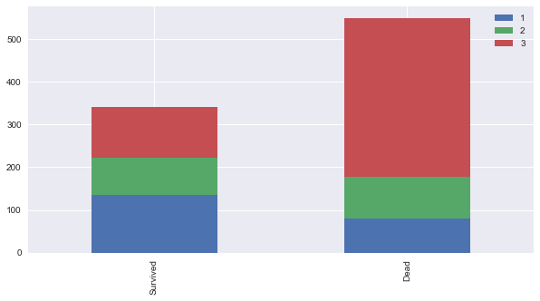
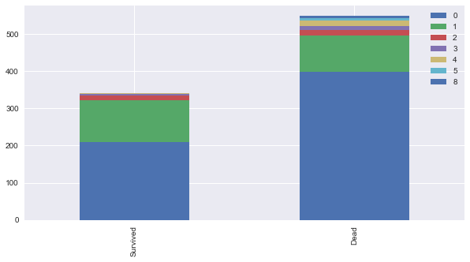
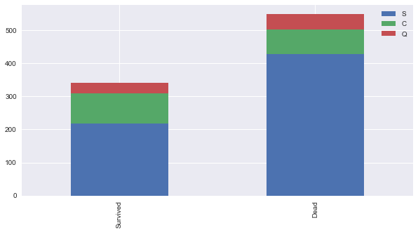
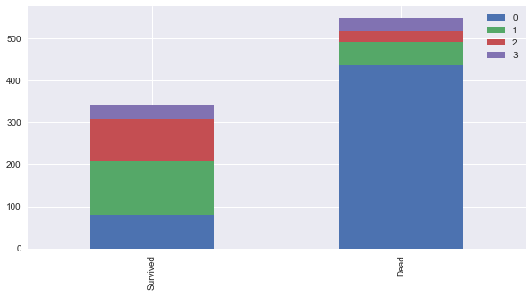
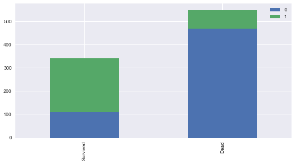
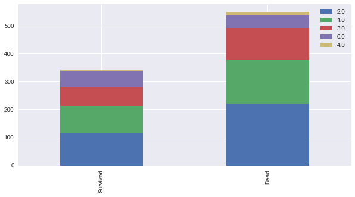

# পাইথন দিয়ে টাইটানিক প্রজেক্ট
> *Python has been an important part of Google since the beginning, and remains so as the system grows and evolves. Today dozens of Google engineers use Python, and we're looking for more people with skills in this language.*

> -- Peter Norvig, Director of search quality at Google, Inc.

"আর" প্রোগ্রামিং এনভায়রনমেন্টএর পাশাপাশি আমরা পুরো এক্সারসাইজটা দেখাবো পাইথনে। এর মানে এই নয় যে আমরা "আর"এ করা এক্সারসাইজটা দেখবো না। এই পাইথনে করা এক্সারসাইজ বুঝতে আমাদের দেখে আসতে হবে পুরো টাইটানিক প্রজেক্ট "আর" এনভায়রনমেন্টে। সব জায়গায় বেসিক কনসেপ্ট একই। তবে, 'আর' দিয়ে বোঝা যায় ভালো। আগেই বলেছি যারা কম্পিউটার প্রযুক্তিতে পড়েননি অথবা মেশিন লার্নিং একদম ভেতর থেকে হাতেকলমে শিখতে চান, তাদের জন্য 'আর' অন্য লেভেলের জিনিস। 

কম্পিউটার প্রযুক্তিতে পড়েছেন আর পাইথন জানেন বলে 'মেশিন লার্নিং' শিখে যাবেন সেটাও ভ্রান্ত ধারণা। পাইথন একটা ভালো ফ্রেমওয়ার্ক, প্রায় অনেককিছুই করা যায়। তাই বলে মেশিন লার্নিং আর পাইথন পাশাপাশি সমার্থক শব্দ সেটা বলা যাবে না। সেটা সামনে গেলে দেখতে পাবেন। 

আমার কথা বললে বলবো, আমি দুটোই শিখেছি কারণ - দুটো 'দুই' জায়গায় ভালো। মেশিন লার্নিং শেখার শুরুতে 'আর' ভালো, প্রোডাকশন লেভেলে পাইথন ভালো। যেখানে যেটা লাগে। ছোট দূরত্বে রিকশা ভালো, বড় দূরত্বে হয়তোবা মোটর সাইকেল ভালো। আমাদের জানতে হবে কোথায় কি লাগবে? যুগটা অপটিমাইজেশনের যুগ। দরকার মতো আরো কিছু জিনিস শিখতে হতে পারে। লজ্জা করলেই ক্ষতি। কিছুই শেখা যাবে না। এই পঞ্চাশ বছরের কাছাকাছি বয়সেও আমাকে শিখতে হচ্ছে অনেককিছু। না শিখলে - ঝরে পড়ে যাবেন যে কেউ। 

## ১. জুপিটার নোটবুক ইনস্টলেশন 

আমরা যারা পাইথন নিয়ে কাজ করি তাদের একটা ডেভেলপমেন্ট ইন্টারফেস দরকার। আর স্টুডিওর মতো কিছু একটা। সেখানে আমরা একটা ওয়েববেসড ইন্টারফেস দিয়ে তৈরি জুপিটার নোটবুক ব্যবহার করবো। পাইথন, আর থেকে শুরু করে এমন কোন নামকরা প্রোগ্রামিং এনভায়রনমেন্ট নেই যেখানে জুপিটার ফ্রেমওয়ার্ক কাজ করে না। মজার কথা হচ্ছে পুরো এনভায়রনমেন্ট ভ্যারিয়েবলসহ আপনার কাজ শেয়ার করা যায় সব জায়গায়, এমনকি গিট্হাবেও। 

### ১.১ জুপিটার ইনস্টলেশন - অ্যানাকোন্ডা

জুপিটারের উইন্ডোজ ইনস্টলেশন একেবারে পানি ভাত। মানে ১. ডাউনলোড করে নিন অ্যানাকোন্ডা, নিচের সাইট থেকে। ২. এরপর ক্লিক, ক্লিক আর ক্লিক। শুধু একটা জিনিস খেয়াল রাখবেন, ইনস্টলেশন পাথে যাতে স্পেস দিয়ে কোন ফোল্ডার না থাকে। উদাহরণ হিসেবে বলা যায় "C:\Users\Test\Anaconda3", ঠিক আছে তো?

https://www.anaconda.com/download/

### ১.২ জুপিটার নোটবুক চালু 

উইন্ডোজের রান অথবা কমান্ড প্রম্পটে লিখুন, পুরোটা লিখতে হয়না। তার আগেই চলে আসে ডেস্কটপ অ্যাপের নাম। 

jupyter notebook

খেয়াল রাখবেন - প্রতিটা কমান্ড লিখবেন In [সংখ্যা] সেলে এবং সেটার আউটপুট আপনি দেখতে পারবেন Out [সংখ্যা] দিয়ে। প্রতিবার কমান্ড লেখার পর 'সেল' মেন্যু অথবা 'সেল' বাটনে 'কোড' হিসেবে সিলেক্ট করে রান বাটন চাপবেন।  

### ১.৩ কোথায় পাবো এই স্ক্রিপ্ট?

https://github.com/raqueeb/mltraining/blob/master/Python/titanic-project.ipynb

## ২. টাইটানিক জাহাজ ডুবিতে বেচেঁ যাবার প্রেডিকশন
ক্যাগল কম্পিটিশন [টাইটানিক: বিপর্যয়ে মেশিন লার্নিং](http://www.kaggle.com/c/titanic)

- প্রবলেম স্টেটমেন্টকে সংজ্ঞায়িত করা
- ডাটা কোথায় পাবো?
- এক্সপ্লোরাটরি ডাটা অ্যানালাইসিস
- ফীচার ইঞ্জিনিয়ারিং
- মডেলিং
- টেস্টিং

### ২.১  প্রবলেম স্টেটমেন্ট: কি সমস্যা সমাধান করবো?

- আমরা জানতে চাইবো কারা কারা বেঁচে বা মারা গিয়েছিলেন?
- আমরা মেশিন লার্নিং টুল ব্যবহার করে দেখতে চাইবো কোন ধরনের মানুষগুলো বেঁচে যাবেন?
*আমাদের এই প্রতিযোগিতা চাচ্ছে যাতে আমরা বাইনারি 'আউটকাম' প্রেডিক্ট করি। এখানে ০ মানে উনি মারা গেছেন, ১ মানে উনি বেঁচে গিয়েছিলেন।* 

### ২.৩ ডাটা কোথায় পাব?
আমরা ডাটা কালেক্ট করবো ক্যাগল সাইট থেকে

- ট্রেনিং ডাটাসেট https://www.kaggle.com/c/titanic/download/train.csv
- টেস্ট ডাটাসেট https://www.kaggle.com/c/titanic/download/test.csv

### ২.৪ ট্রেনিং এবং টেস্ট ডাটা লোড করে নেব পান্ডা দিয়ে

এখন থেকে আমরা সবকিছু রেফার করবো "আর" এর সাথে মিলিয়ে। মনে আছে ডাটাফ্রেমের কথা? পাইথনে ডাটাফ্রেম নিয়ে কাজ করে পান্ডা নামের অসাধারণ লাইব্রেরি। 


```python
import pandas as pd

train = pd.read_csv('datasets/train.csv')
test = pd.read_csv('datasets/test.csv')
```

## ৩. এক্সপ্লোরাটরি ডাটা অ্যানালাইসিস
শুরুতেই ডাটাফ্রেমের মাথা দেখি, মাত্র ৫টা সারি ধরে। train.head ফাংশন মানে দেখাও ট্রেইন ডাটাফ্রেমের মাথার কিছু অংশ। এখানে NaN	মানে ডাটা নেই। ডাটাটা মিসিং। 


```python
train.head(5)
```


<div>
<style>
    .dataframe thead tr:only-child th {
        text-align: right;
    }

    .dataframe thead th {
        text-align: left;
    }

    .dataframe tbody tr th {
        vertical-align: top;
    }
</style>
<table border="1" class="dataframe">
  <thead>
    <tr style="text-align: right;">
      <th></th>
      <th>PassengerId</th>
      <th>Survived</th>
      <th>Pclass</th>
      <th>Name</th>
      <th>Sex</th>
      <th>Age</th>
      <th>SibSp</th>
      <th>Parch</th>
      <th>Ticket</th>
      <th>Fare</th>
      <th>Cabin</th>
      <th>Embarked</th>
    </tr>
  </thead>
  <tbody>
    <tr>
      <th>0</th>
      <td>1</td>
      <td>0</td>
      <td>3</td>
      <td>Braund, Mr. Owen Harris</td>
      <td>male</td>
      <td>22.0</td>
      <td>1</td>
      <td>0</td>
      <td>A/5 21171</td>
      <td>7.2500</td>
      <td>NaN</td>
      <td>S</td>
    </tr>
    <tr>
      <th>1</th>
      <td>2</td>
      <td>1</td>
      <td>1</td>
      <td>Cumings, Mrs. John Bradley (Florence Briggs Th...</td>
      <td>female</td>
      <td>38.0</td>
      <td>1</td>
      <td>0</td>
      <td>PC 17599</td>
      <td>71.2833</td>
      <td>C85</td>
      <td>C</td>
    </tr>
    <tr>
      <th>2</th>
      <td>3</td>
      <td>1</td>
      <td>3</td>
      <td>Heikkinen, Miss. Laina</td>
      <td>female</td>
      <td>26.0</td>
      <td>0</td>
      <td>0</td>
      <td>STON/O2. 3101282</td>
      <td>7.9250</td>
      <td>NaN</td>
      <td>S</td>
    </tr>
    <tr>
      <th>3</th>
      <td>4</td>
      <td>1</td>
      <td>1</td>
      <td>Futrelle, Mrs. Jacques Heath (Lily May Peel)</td>
      <td>female</td>
      <td>35.0</td>
      <td>1</td>
      <td>0</td>
      <td>113803</td>
      <td>53.1000</td>
      <td>C123</td>
      <td>S</td>
    </tr>
    <tr>
      <th>4</th>
      <td>5</td>
      <td>0</td>
      <td>3</td>
      <td>Allen, Mr. William Henry</td>
      <td>male</td>
      <td>35.0</td>
      <td>0</td>
      <td>0</td>
      <td>373450</td>
      <td>8.0500</td>
      <td>NaN</td>
      <td>S</td>
    </tr>
  </tbody>
</table>
</div>


### ৩.১ ডাটা ডিকশনারি 

- ভ্যারিয়েবল	- মানে কি?	- ভ্যালু কি হতে পারে

- survival	= বেঁচে গিয়েছেন/মারা গিয়েছেন	1 = বেঁচে গিয়েছেন; 0 = মারা গিয়েছেন

- pclass	= টিকেটের ক্লাস বা শ্রেণী	1st = প্রথম; 2nd = দ্বিতীয়; 3rd = তৃতীয়

- sex	= মহিলা না পুরুষ

- Age	= বয়স বছরে,	এখানে অনেক ডাটা মিসিং

- sibsp	= উনার ভাইবোন অথবা স্বামী/স্ত্রীর সংখ্যা, ওই টাইটানিক জাহাজে,	siblings / spouses সংখ্যায়

- parch	= উনার বাবা মা অথবা বাচ্চাদের সংখ্যা,	parent /children সংখ্যায়

- ticket	= টিকেট নাম্বার,	কেবিন নম্বর ধরে টিকেট নম্বর

- fare	= টাইটানিক যাত্রীর ভাড়া	

- cabin	= টাইটানিকের কেবিন নাম্বার	

- embarked	= কোথা থেকে উঠেছেন, বিশেষ করে কোন পোর্ট থেকে	C = Cherbourg, Q = Queenstown, S = Southampton

আমরা জানতে চাইবো কতোটা সারি আর কলাম আছে আমাদের ডাটাসেটে। আমরা দেখতে পাচ্ছি ৮৯১ কলাম আর ১২ সারি। 


```python
train.shape
```


    (891, 12)


```python
test.shape
```


    (418, 11)


```python
train.info()
```

    <class 'pandas.core.frame.DataFrame'>
    RangeIndex: 891 entries, 0 to 890
    Data columns (total 12 columns):
    PassengerId    891 non-null int64
    Survived       891 non-null int64
    Pclass         891 non-null int64
    Name           891 non-null object
    Sex            891 non-null object
    Age            714 non-null float64
    SibSp          891 non-null int64
    Parch          891 non-null int64
    Ticket         891 non-null object
    Fare           891 non-null float64
    Cabin          204 non-null object
    Embarked       889 non-null object
    dtypes: float64(2), int64(5), object(5)
    memory usage: 83.6+ KB
    

আপনারা দেখেছেন কি? Age, Cabin, Embarked ভ্যারিয়েবলগুলোতে ডাটা মিসিং। 


```python
test.info()
```

    <class 'pandas.core.frame.DataFrame'>
    RangeIndex: 418 entries, 0 to 417
    Data columns (total 11 columns):
    PassengerId    418 non-null int64
    Pclass         418 non-null int64
    Name           418 non-null object
    Sex            418 non-null object
    Age            332 non-null float64
    SibSp          418 non-null int64
    Parch          418 non-null int64
    Ticket         418 non-null object
    Fare           417 non-null float64
    Cabin          91 non-null object
    Embarked       418 non-null object
    dtypes: float64(2), int64(4), object(5)
    memory usage: 36.0+ KB
    

আমরা দেখতে পাচ্ছি বয়স ভ্যারিয়েবলটাতে অনেক ভ্যালু মিসিং। বেশ সমস্যার কথা। ৮৯১ সারির মধ্যে ৭১৪ সারিতে ভ্যালু আছে। কেবিনে দেখা যাচ্ছে মাত্র ২০৪টাতে ভ্যালু আছে। ভয়ঙ্কর সমস্যা। ডাটাফ্রেমে কোন কোন ভ্যারিয়েবলে কতোটা ভ্যালু মিসিং (NaN) সেটা জানতে আমরা ব্যবহার করছি isnull() মেথড + এরপর সেগুলোকে যোগ করেছি sum() মেথড দিয়ে। 


```python
train.isnull().sum()
```


    PassengerId      0
    Survived         0
    Pclass           0
    Name             0
    Sex              0
    Age            177
    SibSp            0
    Parch            0
    Ticket           0
    Fare             0
    Cabin          687
    Embarked         2
    dtype: int64


```python
test.isnull().sum()
```


    PassengerId      0
    Pclass           0
    Name             0
    Sex              0
    Age             86
    SibSp            0
    Parch            0
    Ticket           0
    Fare             1
    Cabin          327
    Embarked         0
    dtype: int64


টেস্ট ডাটাফ্রেমে একই কাহিনী। মানে ডাটা মিসিং। এখানে ১৭৭টা সারি মিসিং বয়স ভ্যারিয়েবলে। কেবিনের সাথে কানেক্ট করা যাচ্ছে না ৬৮৭টা ভ্যালু। কোথা থেকে কে উঠেছে সেটাতে নেই ২টা ভ্যালু। আগেই দেখেছেন কেন সমস্যা করে মিসিং ভ্যালু? জানতে হলে আপনাকে পড়তে হবে মেশিন লার্নিং প্রেডিকশন চ্যাপ্টারটা।  

## ৪. ডাটা ভিজ্যুয়ালাইজেশন

এটা ঠিক যে পাইথনও আস্তে আস্তে সুন্দর হয়ে উঠছে ডাটা ভিজ্যুয়ালাইজেশন লাইব্রেরিতে। matplotlib.pyplot লাইব্রেরি দেয় আমাদের ম্যাটল্যাবের মতো চমৎকার প্লটিং ফ্রেমওয়ার্ক। ছবিগুলো জুপিটার নোটবুকে একসাথে দেখানোর জন্য inline মোড নিয়ে আসা হয়েছে। seaborn হচ্ছে পাইথনের matplotlib ভিত্তিক স্ট্যাটিসটিকাল গ্রাফিক্যাল লাইব্রেরি। সুন্দর বটে। 


```python
import matplotlib.pyplot as plt
%matplotlib inline
import seaborn as sns
sns.set()
```

### ৪.১ ক্যাটেগরিক্যাল ফিচারগুলো নিয়ে বার চার্ট 
- Pclass
- Sex
- SibSp
- Parch
- Embarked
- Cabin

এখানে আমরা ছবি দিয়ে একটা সম্পর্ক খুঁজবো কারা কারা বেঁচে গিয়েছিলেন - বাকি ভ্যারিয়েবলগুলোর সাথে কানেক্ট করে। পাইথনে একটা বারচার্ট ফাংশন ডিফাইন করছি যাতে বিভিন্ন ভ্যারিয়েবলগুলোকে একেকটা প্যারামিটার ধরে ধরে পাঠাতে পারি আমাদের নতুন তৈরি করা ফাংশনে। এখানে দুটো বারচার্ট তৈরি করবে আমাদের প্যারামিটার - ['Survived','Dead'] - সবকিছুর ভ্যালুগুলোকে যোগ করবো শেষে। 


```python
def bar_chart(feature):
    survived = train[train['Survived']==1][feature].value_counts()
    dead = train[train['Survived']==0][feature].value_counts()
    df = pd.DataFrame([survived,dead])
    df.index = ['Survived','Dead']
    df.plot(kind='bar',stacked=True, figsize=(10,5))
```

এখন ফিচারে পাঠাই একটা করে আমাদের ভ্যারিয়েবলগুলোকে। শুরুতেই 'Sex'


```python
bar_chart('Sex')
```


এই চার্ট বলছে পুরুষ থেকে বেশি বেঁচেছেন মহিলারা। পরেরটা 'Pclass'


```python
bar_chart('Pclass')
```





এখানে দেখা গেলো প্রথম শ্রেণীর যাত্রীরা বেঁচেছেন বেশি। এদিকে তৃতীয় শ্রেনীর যাত্রীরাও মারা গিয়েছেন অন্য যেকোন শ্রেণী থেকে। 


```python
bar_chart('SibSp')
```





এখানের ব্যাপারটা একটু ভাবিয়েছে আমাদের। ওই ফ্যামিলিগুলোতে যারা দুই জনের বেশি ছিলেন তারা বেঁচেছিলেন বেশি। যারা শুধুমাত্র নিজেরা মানে একা ছিলেন তারা বেঁচেছেন কম। 


```python
bar_chart('Parch')
```


যারা বাবা মা অথবা বাচ্চাদের নিয়ে ছিলেন টাইটানিকে - তারা বেঁচেছেন বেশি। যারা একা ছিলেন তারা অতোটা বাঁচতে পারেননি। 


```python
bar_chart('Embarked')
```





এই চার্ট কি বলে?

যারা Cherbourg থেকে উঠেছিলেন তারা অন্য জায়গা থেকে ওঠা মানুষদের থেকে বেঁচেছেন বেশি। Queenstown আর Southampton থেকে ওঠা মানুষগুলো বাঁচেননি বেশি। এর মানে হচ্ছে Cherbourg এলাকার মানুষ অবস্থাপন্ন।  

## ৫. ফিচার ইঞ্জিনিয়ারিং

এটা নিয়ে একটা বিশাল বড় চ্যাপ্টার লিখেছি আগে। মেশিন লার্নিং প্রেডিকশন নিয়ে। 'ফিচার ইঞ্জিনিয়ারিং' হচ্ছে একটা ডোমেইন নলেজ নিয়ে কিছু ফিচার তৈরী করা যাতে আমাদের মেশিন লার্নিং অ্যালগরিদম চমৎকারভাবে কাজ করে। আমি অনুরোধ করবো সেই চ্যাপ্টারটা আবার দেখে নিতে। কারণ এটা একটা খুবই দরকারি জিনিস। 

আমরা জানি মেশিন তো আমার আপনার মতো ফিচার চেনে না। তার জন্য সেটাকে সংখ্যায় দিলে ভালো কাজ করে। সেরকম কিছু করবো আমরা এখানে। শুরুতেই আমরা ভালোভাবে দেখি আমাদের ডাটাসেটগুলো। 

### ৫.১ আচ্ছা, টাইটানিকের কিভাবে ডুবেছিল?
আমরা এখানে রিসার্চ করতে গিয়ে দেখলাম টাইটানিকের পেছনের দিক থেকে ডোবা শুরু করেছিল। আর ওখানেই শুরু হয়েছিল ৩য় শ্রেণী। তারমানে Pclas কিন্তু একটা বড় ক্লাসিফায়ার। একটু পেছনে গেলে দেখবেন কিভাবে নাম এখানে বড় একটা রোল প্লে করেছিল। 

### ৫.২ নাম 
প্রথমেই যোগ করে নেই টেস্ট আর ট্রেনিং ডাটাসেট। 'Title' ডাটাসেট তৈরি করি নাম থেকে। 


```python
train_test_data = [train, test] 

for dataset in train_test_data:
    dataset['Title'] = dataset['Name'].str.extract(' ([A-Za-z]+)\.', expand=False)
```

ট্রেইন আর টেস্ট ডাটাসেটে টাইটেলগুলোর সংখ্যা বের করি। এর আগেও ব্যাপারটা করেছিলাম "আর" দিয়ে। 


```python
train['Title'].value_counts()
```


    Mr          517
    Miss        182
    Mrs         125
    Master       40
    Dr            7
    Rev           6
    Major         2
    Col           2
    Mlle          2
    Mme           1
    Ms            1
    Sir           1
    Capt          1
    Countess      1
    Don           1
    Lady          1
    Jonkheer      1
    Name: Title, dtype: int64


```python
test['Title'].value_counts()
```


    Mr        240
    Miss       78
    Mrs        72
    Master     21
    Rev         2
    Col         2
    Ms          1
    Dr          1
    Dona        1
    Name: Title, dtype: int64


#### টাইটেলগুলোকে ম্যাপ করি সংখ্যার সাথে 

আগের মতো বাকি অদরকারি টাইটেলগুলোকে ম্যাপ করে দেই ৩ এর সাথে। 

Mr : 0  
Miss : 1  
Mrs: 2  
Others: 3


```python
title_mapping = {"Mr": 0, "Miss": 1, "Mrs": 2, 
                 "Master": 3, "Dr": 3, "Rev": 3, "Col": 3, "Major": 3, "Mlle": 3,"Countess": 3,
                 "Ms": 3, "Lady": 3, "Jonkheer": 3, "Don": 3, "Dona" : 3, "Mme": 3,"Capt": 3,"Sir": 3 }
for dataset in train_test_data:
    dataset['Title'] = dataset['Title'].map(title_mapping)
```

ভালো করে দেখুন Title ভ্যারিয়েবলগুলো। নতুন ম্যাপিং হয়ে গেছে আমাদের দরকার মতো। 


```python
train.head()
```


<div>
<style>
    .dataframe thead tr:only-child th {
        text-align: right;
    }

    .dataframe thead th {
        text-align: left;
    }

    .dataframe tbody tr th {
        vertical-align: top;
    }
</style>
<table border="1" class="dataframe">
  <thead>
    <tr style="text-align: right;">
      <th></th>
      <th>PassengerId</th>
      <th>Survived</th>
      <th>Pclass</th>
      <th>Name</th>
      <th>Sex</th>
      <th>Age</th>
      <th>SibSp</th>
      <th>Parch</th>
      <th>Ticket</th>
      <th>Fare</th>
      <th>Cabin</th>
      <th>Embarked</th>
      <th>Title</th>
    </tr>
  </thead>
  <tbody>
    <tr>
      <th>0</th>
      <td>1</td>
      <td>0</td>
      <td>3</td>
      <td>Braund, Mr. Owen Harris</td>
      <td>male</td>
      <td>22.0</td>
      <td>1</td>
      <td>0</td>
      <td>A/5 21171</td>
      <td>7.2500</td>
      <td>NaN</td>
      <td>S</td>
      <td>0</td>
    </tr>
    <tr>
      <th>1</th>
      <td>2</td>
      <td>1</td>
      <td>1</td>
      <td>Cumings, Mrs. John Bradley (Florence Briggs Th...</td>
      <td>female</td>
      <td>38.0</td>
      <td>1</td>
      <td>0</td>
      <td>PC 17599</td>
      <td>71.2833</td>
      <td>C85</td>
      <td>C</td>
      <td>2</td>
    </tr>
    <tr>
      <th>2</th>
      <td>3</td>
      <td>1</td>
      <td>3</td>
      <td>Heikkinen, Miss. Laina</td>
      <td>female</td>
      <td>26.0</td>
      <td>0</td>
      <td>0</td>
      <td>STON/O2. 3101282</td>
      <td>7.9250</td>
      <td>NaN</td>
      <td>S</td>
      <td>1</td>
    </tr>
    <tr>
      <th>3</th>
      <td>4</td>
      <td>1</td>
      <td>1</td>
      <td>Futrelle, Mrs. Jacques Heath (Lily May Peel)</td>
      <td>female</td>
      <td>35.0</td>
      <td>1</td>
      <td>0</td>
      <td>113803</td>
      <td>53.1000</td>
      <td>C123</td>
      <td>S</td>
      <td>2</td>
    </tr>
    <tr>
      <th>4</th>
      <td>5</td>
      <td>0</td>
      <td>3</td>
      <td>Allen, Mr. William Henry</td>
      <td>male</td>
      <td>35.0</td>
      <td>0</td>
      <td>0</td>
      <td>373450</td>
      <td>8.0500</td>
      <td>NaN</td>
      <td>S</td>
      <td>0</td>
    </tr>
  </tbody>
</table>
</div>


```python
test.head()
```


<div>
<style>
    .dataframe thead tr:only-child th {
        text-align: right;
    }

    .dataframe thead th {
        text-align: left;
    }

    .dataframe tbody tr th {
        vertical-align: top;
    }
</style>
<table border="1" class="dataframe">
  <thead>
    <tr style="text-align: right;">
      <th></th>
      <th>PassengerId</th>
      <th>Pclass</th>
      <th>Name</th>
      <th>Sex</th>
      <th>Age</th>
      <th>SibSp</th>
      <th>Parch</th>
      <th>Ticket</th>
      <th>Fare</th>
      <th>Cabin</th>
      <th>Embarked</th>
      <th>Title</th>
    </tr>
  </thead>
  <tbody>
    <tr>
      <th>0</th>
      <td>892</td>
      <td>3</td>
      <td>Kelly, Mr. James</td>
      <td>male</td>
      <td>34.5</td>
      <td>0</td>
      <td>0</td>
      <td>330911</td>
      <td>7.8292</td>
      <td>NaN</td>
      <td>Q</td>
      <td>0</td>
    </tr>
    <tr>
      <th>1</th>
      <td>893</td>
      <td>3</td>
      <td>Wilkes, Mrs. James (Ellen Needs)</td>
      <td>female</td>
      <td>47.0</td>
      <td>1</td>
      <td>0</td>
      <td>363272</td>
      <td>7.0000</td>
      <td>NaN</td>
      <td>S</td>
      <td>2</td>
    </tr>
    <tr>
      <th>2</th>
      <td>894</td>
      <td>2</td>
      <td>Myles, Mr. Thomas Francis</td>
      <td>male</td>
      <td>62.0</td>
      <td>0</td>
      <td>0</td>
      <td>240276</td>
      <td>9.6875</td>
      <td>NaN</td>
      <td>Q</td>
      <td>0</td>
    </tr>
    <tr>
      <th>3</th>
      <td>895</td>
      <td>3</td>
      <td>Wirz, Mr. Albert</td>
      <td>male</td>
      <td>27.0</td>
      <td>0</td>
      <td>0</td>
      <td>315154</td>
      <td>8.6625</td>
      <td>NaN</td>
      <td>S</td>
      <td>0</td>
    </tr>
    <tr>
      <th>4</th>
      <td>896</td>
      <td>3</td>
      <td>Hirvonen, Mrs. Alexander (Helga E Lindqvist)</td>
      <td>female</td>
      <td>22.0</td>
      <td>1</td>
      <td>1</td>
      <td>3101298</td>
      <td>12.2875</td>
      <td>NaN</td>
      <td>S</td>
      <td>2</td>
    </tr>
  </tbody>
</table>
</div>


```python
bar_chart('Title')
```





টাইটেল বের করার পর নাম দরকার আছে কি? ফেলে দেই 'Name' ভ্যারিয়েবল। 


```python
# delete unnecessary feature from dataset
train.drop('Name', axis=1, inplace=True)
test.drop('Name', axis=1, inplace=True)
```


```python
train.head()
```


<div>
<style>
    .dataframe thead tr:only-child th {
        text-align: right;
    }

    .dataframe thead th {
        text-align: left;
    }

    .dataframe tbody tr th {
        vertical-align: top;
    }
</style>
<table border="1" class="dataframe">
  <thead>
    <tr style="text-align: right;">
      <th></th>
      <th>PassengerId</th>
      <th>Survived</th>
      <th>Pclass</th>
      <th>Sex</th>
      <th>Age</th>
      <th>SibSp</th>
      <th>Parch</th>
      <th>Ticket</th>
      <th>Fare</th>
      <th>Cabin</th>
      <th>Embarked</th>
      <th>Title</th>
    </tr>
  </thead>
  <tbody>
    <tr>
      <th>0</th>
      <td>1</td>
      <td>0</td>
      <td>3</td>
      <td>male</td>
      <td>22.0</td>
      <td>1</td>
      <td>0</td>
      <td>A/5 21171</td>
      <td>7.2500</td>
      <td>NaN</td>
      <td>S</td>
      <td>0</td>
    </tr>
    <tr>
      <th>1</th>
      <td>2</td>
      <td>1</td>
      <td>1</td>
      <td>female</td>
      <td>38.0</td>
      <td>1</td>
      <td>0</td>
      <td>PC 17599</td>
      <td>71.2833</td>
      <td>C85</td>
      <td>C</td>
      <td>2</td>
    </tr>
    <tr>
      <th>2</th>
      <td>3</td>
      <td>1</td>
      <td>3</td>
      <td>female</td>
      <td>26.0</td>
      <td>0</td>
      <td>0</td>
      <td>STON/O2. 3101282</td>
      <td>7.9250</td>
      <td>NaN</td>
      <td>S</td>
      <td>1</td>
    </tr>
    <tr>
      <th>3</th>
      <td>4</td>
      <td>1</td>
      <td>1</td>
      <td>female</td>
      <td>35.0</td>
      <td>1</td>
      <td>0</td>
      <td>113803</td>
      <td>53.1000</td>
      <td>C123</td>
      <td>S</td>
      <td>2</td>
    </tr>
    <tr>
      <th>4</th>
      <td>5</td>
      <td>0</td>
      <td>3</td>
      <td>male</td>
      <td>35.0</td>
      <td>0</td>
      <td>0</td>
      <td>373450</td>
      <td>8.0500</td>
      <td>NaN</td>
      <td>S</td>
      <td>0</td>
    </tr>
  </tbody>
</table>
</div>


নাম কিন্তু নেই আর!


```python
test.head()
```


<div>
<style>
    .dataframe thead tr:only-child th {
        text-align: right;
    }

    .dataframe thead th {
        text-align: left;
    }

    .dataframe tbody tr th {
        vertical-align: top;
    }
</style>
<table border="1" class="dataframe">
  <thead>
    <tr style="text-align: right;">
      <th></th>
      <th>PassengerId</th>
      <th>Pclass</th>
      <th>Sex</th>
      <th>Age</th>
      <th>SibSp</th>
      <th>Parch</th>
      <th>Ticket</th>
      <th>Fare</th>
      <th>Cabin</th>
      <th>Embarked</th>
      <th>Title</th>
    </tr>
  </thead>
  <tbody>
    <tr>
      <th>0</th>
      <td>892</td>
      <td>3</td>
      <td>male</td>
      <td>34.5</td>
      <td>0</td>
      <td>0</td>
      <td>330911</td>
      <td>7.8292</td>
      <td>NaN</td>
      <td>Q</td>
      <td>0</td>
    </tr>
    <tr>
      <th>1</th>
      <td>893</td>
      <td>3</td>
      <td>female</td>
      <td>47.0</td>
      <td>1</td>
      <td>0</td>
      <td>363272</td>
      <td>7.0000</td>
      <td>NaN</td>
      <td>S</td>
      <td>2</td>
    </tr>
    <tr>
      <th>2</th>
      <td>894</td>
      <td>2</td>
      <td>male</td>
      <td>62.0</td>
      <td>0</td>
      <td>0</td>
      <td>240276</td>
      <td>9.6875</td>
      <td>NaN</td>
      <td>Q</td>
      <td>0</td>
    </tr>
    <tr>
      <th>3</th>
      <td>895</td>
      <td>3</td>
      <td>male</td>
      <td>27.0</td>
      <td>0</td>
      <td>0</td>
      <td>315154</td>
      <td>8.6625</td>
      <td>NaN</td>
      <td>S</td>
      <td>0</td>
    </tr>
    <tr>
      <th>4</th>
      <td>896</td>
      <td>3</td>
      <td>female</td>
      <td>22.0</td>
      <td>1</td>
      <td>1</td>
      <td>3101298</td>
      <td>12.2875</td>
      <td>NaN</td>
      <td>S</td>
      <td>2</td>
    </tr>
  </tbody>
</table>
</div>


### ৫.৩ মহিলা পুরুষকে ম্যাপিং করি সংখ্যায় 

male: 0
female: 1


```python
sex_mapping = {"male": 0, "female": 1}
for dataset in train_test_data:
    dataset['Sex'] = dataset['Sex'].map(sex_mapping)
```


```python
bar_chart('Sex')
```





এখানে কিন্তু মহিলা পুরুষ নেই আর! সেখানে তাদেরকে রিপ্রেজেন্ট করা হচ্ছে ০ এবং ১ দিয়ে। 

### ৫.৪ বয়স 

#### ৫.৪.১ প্রচুর বয়সের ডাটা মিসিং আছে আমাদের ডাটাসেটে 
একটা কাজ করি বরং 

টাইটেলের "গড়" বয়স দিয়ে ভরে ফেলি আমাদের না থাকা ভ্যালুগুলোর জায়গায় - তাহলে আমাদের Random-Forest এনসেমবল ক্লাসিফায়ার ভালো ভাবে কাজ করবে। "Mr": 0, "Miss": 1, "Mrs": 2 এবং Others: 3 এর গড় বয়স দিয়ে দিচ্ছি এখানে। 


```python
train.head()
```


<div>
<style>
    .dataframe thead tr:only-child th {
        text-align: right;
    }

    .dataframe thead th {
        text-align: left;
    }

    .dataframe tbody tr th {
        vertical-align: top;
    }
</style>
<table border="1" class="dataframe">
  <thead>
    <tr style="text-align: right;">
      <th></th>
      <th>PassengerId</th>
      <th>Survived</th>
      <th>Pclass</th>
      <th>Sex</th>
      <th>Age</th>
      <th>SibSp</th>
      <th>Parch</th>
      <th>Ticket</th>
      <th>Fare</th>
      <th>Cabin</th>
      <th>Embarked</th>
      <th>Title</th>
    </tr>
  </thead>
  <tbody>
    <tr>
      <th>0</th>
      <td>1</td>
      <td>0</td>
      <td>3</td>
      <td>0</td>
      <td>22.0</td>
      <td>1</td>
      <td>0</td>
      <td>A/5 21171</td>
      <td>7.2500</td>
      <td>NaN</td>
      <td>S</td>
      <td>0</td>
    </tr>
    <tr>
      <th>1</th>
      <td>2</td>
      <td>1</td>
      <td>1</td>
      <td>1</td>
      <td>38.0</td>
      <td>1</td>
      <td>0</td>
      <td>PC 17599</td>
      <td>71.2833</td>
      <td>C85</td>
      <td>C</td>
      <td>2</td>
    </tr>
    <tr>
      <th>2</th>
      <td>3</td>
      <td>1</td>
      <td>3</td>
      <td>1</td>
      <td>26.0</td>
      <td>0</td>
      <td>0</td>
      <td>STON/O2. 3101282</td>
      <td>7.9250</td>
      <td>NaN</td>
      <td>S</td>
      <td>1</td>
    </tr>
    <tr>
      <th>3</th>
      <td>4</td>
      <td>1</td>
      <td>1</td>
      <td>1</td>
      <td>35.0</td>
      <td>1</td>
      <td>0</td>
      <td>113803</td>
      <td>53.1000</td>
      <td>C123</td>
      <td>S</td>
      <td>2</td>
    </tr>
    <tr>
      <th>4</th>
      <td>5</td>
      <td>0</td>
      <td>3</td>
      <td>0</td>
      <td>35.0</td>
      <td>0</td>
      <td>0</td>
      <td>373450</td>
      <td>8.0500</td>
      <td>NaN</td>
      <td>S</td>
      <td>0</td>
    </tr>
  </tbody>
</table>
</div>


```python
# fill missing age with median age for each title (Mr, Mrs, Miss, Others)
train["Age"].fillna(train.groupby("Title")["Age"].transform("median"), inplace=True)
test["Age"].fillna(test.groupby("Title")["Age"].transform("median"), inplace=True)
```


```python
train.groupby("Title")["Age"].transform("median")
train.head()
```


<div>
<style>
    .dataframe thead tr:only-child th {
        text-align: right;
    }

    .dataframe thead th {
        text-align: left;
    }

    .dataframe tbody tr th {
        vertical-align: top;
    }
</style>
<table border="1" class="dataframe">
  <thead>
    <tr style="text-align: right;">
      <th></th>
      <th>PassengerId</th>
      <th>Survived</th>
      <th>Pclass</th>
      <th>Sex</th>
      <th>Age</th>
      <th>SibSp</th>
      <th>Parch</th>
      <th>Ticket</th>
      <th>Fare</th>
      <th>Cabin</th>
      <th>Embarked</th>
      <th>Title</th>
    </tr>
  </thead>
  <tbody>
    <tr>
      <th>0</th>
      <td>1</td>
      <td>0</td>
      <td>3</td>
      <td>0</td>
      <td>22.0</td>
      <td>1</td>
      <td>0</td>
      <td>A/5 21171</td>
      <td>7.2500</td>
      <td>NaN</td>
      <td>S</td>
      <td>0</td>
    </tr>
    <tr>
      <th>1</th>
      <td>2</td>
      <td>1</td>
      <td>1</td>
      <td>1</td>
      <td>38.0</td>
      <td>1</td>
      <td>0</td>
      <td>PC 17599</td>
      <td>71.2833</td>
      <td>C85</td>
      <td>C</td>
      <td>2</td>
    </tr>
    <tr>
      <th>2</th>
      <td>3</td>
      <td>1</td>
      <td>3</td>
      <td>1</td>
      <td>26.0</td>
      <td>0</td>
      <td>0</td>
      <td>STON/O2. 3101282</td>
      <td>7.9250</td>
      <td>NaN</td>
      <td>S</td>
      <td>1</td>
    </tr>
    <tr>
      <th>3</th>
      <td>4</td>
      <td>1</td>
      <td>1</td>
      <td>1</td>
      <td>35.0</td>
      <td>1</td>
      <td>0</td>
      <td>113803</td>
      <td>53.1000</td>
      <td>C123</td>
      <td>S</td>
      <td>2</td>
    </tr>
    <tr>
      <th>4</th>
      <td>5</td>
      <td>0</td>
      <td>3</td>
      <td>0</td>
      <td>35.0</td>
      <td>0</td>
      <td>0</td>
      <td>373450</td>
      <td>8.0500</td>
      <td>NaN</td>
      <td>S</td>
      <td>0</td>
    </tr>
  </tbody>
</table>
</div>


দেখুন কোন বয়স কিন্তু আর বাদ নেই। বয়সকে গড় টাইটেলের আউটকাম দিয়ে ভর্তি করা হয়েছে। 

আমরা একটা চার্ট আঁকি এখানে। মারা যাওয়া মানুষগুলোর বয়স ১৬ থেকে ৩৪ এর মধ্যে বেশি দেখা যাচ্ছে আমাদের ছবিতে। তার আগের অথবা পরের বয়সগুলোর মানুষ বেঁচে গিয়েছে বেশি। প্লটে দেখা যাচ্ছে ৩০ বছরের মানুষগুলো মারা গিয়েছে বেশি। আমরা অনেকগুলো চার্ট আঁকবো কারণ আমাদের বয়স কিন্তু একটা বড়ো ক্লাসিফায়ার। প্রথমে কোন লিমিট রাখবো না - মানে শুরু থেকে শেষ পর্যন্ত - facet.set(xlim=(0, train['Age'].max()))


```python
facet = sns.FacetGrid(train, hue="Survived",aspect=4)
facet.map(sns.kdeplot,'Age',shade= True)
facet.set(xlim=(0, train['Age'].max()))
facet.add_legend()
 
plt.show() 
```


আমাদের প্লটের বয়সসীমা কমিয়ে নিয়ে আসি ০ থেকে ২০ এর মধ্যে plt.xlim(0, 20) দিয়ে। এরপর ২০ থেকে ৩০, ৪০, ৫০, ৬০, ৭০ এবং ৮০ পর্যন্ত। আপনার মেশিন, আপনার মনের মাধুরী মিশিয়ে তৈরি করুন একেকটা প্লট। নিচের দিকে দেখলেই বুঝবেন ০ থেকে ৮০ বছর পর্যন্ত বয়স দেয়া আছে নিচের এক্সিসে। 

#### ছবির মানে কী? 

আপনারা ভালো করে লক্ষ্য করলে দেখবেন "০" মানে মারা গিয়েছেন ৩০ বছর বয়সের মানুষ বেশি। আবার বেঁচেছেন ২০ থেকে ৩৪ বছর বয়সের মানুষ। নিচের চারটা ছবি দেখলে তাই মনে হয়। ডাটার ঘনত্ব ৩০ থেকে ৩৪ বয়সের দিকে।


```python
facet = sns.FacetGrid(train, hue="Survived",aspect=4)
facet.map(sns.kdeplot,'Age',shade= True)
facet.set(xlim=(0, train['Age'].max()))
facet.add_legend()
plt.xlim(0, 20)
```


    (0, 20)


```python
facet = sns.FacetGrid(train, hue="Survived",aspect=4)
facet.map(sns.kdeplot,'Age',shade= True)
facet.set(xlim=(0, train['Age'].max()))
facet.add_legend()
plt.xlim(20, 30)
```


    (20, 30)


```python
facet = sns.FacetGrid(train, hue="Survived",aspect=4)
facet.map(sns.kdeplot,'Age',shade= True)
facet.set(xlim=(0, train['Age'].max()))
facet.add_legend()
plt.xlim(30, 40)
```


    (30, 40)


```python
facet = sns.FacetGrid(train, hue="Survived",aspect=4)
facet.map(sns.kdeplot,'Age',shade= True)
facet.set(xlim=(0, train['Age'].max()))
facet.add_legend()
plt.xlim(40, 60)
```


    (40, 60)


এখন দেখি ডাটা কি কথা বলে? Cabin এবং Embarked এখনো কিছু ফাঁকা! উপরের ছবি দেখে আমরা বেশ কিছু ধারণা পেয়েছি - বয়স ০, থেকে ২০, ৩০ না করে দেখা গেল তাদের ভ্যারিয়েশন কিছুটা ভিন্ন। সেজন্য আমরা নিয়ে এসেছি আলাদা আলাদা বাক্স পদ্ধতি। অনেকে এটাকে বলেন 'বিনিং' মানে ভিন্ন ভিন্ন 'বিন' মানে ব্যাগ বা বাক্সে ফেলা। আমাদের ক্লাসিফায়ার এটাকে অনেক পছন্দ করবে। 


```python
train.info()
```

    <class 'pandas.core.frame.DataFrame'>
    RangeIndex: 891 entries, 0 to 890
    Data columns (total 12 columns):
    PassengerId    891 non-null int64
    Survived       891 non-null int64
    Pclass         891 non-null int64
    Sex            891 non-null int64
    Age            891 non-null float64
    SibSp          891 non-null int64
    Parch          891 non-null int64
    Ticket         891 non-null object
    Fare           891 non-null float64
    Cabin          204 non-null object
    Embarked       889 non-null object
    Title          891 non-null int64
    dtypes: float64(2), int64(7), object(3)
    memory usage: 83.6+ KB
    


```python
test.info()
```

    <class 'pandas.core.frame.DataFrame'>
    RangeIndex: 418 entries, 0 to 417
    Data columns (total 11 columns):
    PassengerId    418 non-null int64
    Pclass         418 non-null int64
    Sex            418 non-null int64
    Age            418 non-null float64
    SibSp          418 non-null int64
    Parch          418 non-null int64
    Ticket         418 non-null object
    Fare           417 non-null float64
    Cabin          91 non-null object
    Embarked       418 non-null object
    Title          418 non-null int64
    dtypes: float64(2), int64(6), object(3)
    memory usage: 36.0+ KB
    

#### ৫.৪.২ বয়সকে ভিন্ন ভিন্ন ব্যাগে ফেলা 
বয়সের মতো কন্টিনিউয়াস ভ্যারিয়েবলকে পাল্টে ফেলছি ক্যাটেগরিক্যাল ভ্যারিয়েবলে। বয়সটা দেখুন ভালো করে। ১৬ এবং ১৬ এর নিচে, ২৬ এবং ৩৬ এর নিচে, ৩৬, .... ৬২ এবং তার ওপরে। 

এখানে আমাদের ফিচার ভেক্টর ম্যাপ হতে পারে এধরনের ৫টা ভাগে:  
child: 0  
young: 1  
adult: 2  
mid-age: 3  
senior: 4


```python
for dataset in train_test_data:
    dataset.loc[ dataset['Age'] <= 16, 'Age'] = 0,
    dataset.loc[(dataset['Age'] > 16) & (dataset['Age'] <= 26), 'Age'] = 1,
    dataset.loc[(dataset['Age'] > 26) & (dataset['Age'] <= 36), 'Age'] = 2,
    dataset.loc[(dataset['Age'] > 36) & (dataset['Age'] <= 62), 'Age'] = 3,
    dataset.loc[ dataset['Age'] > 62, 'Age'] = 4
```

বয়স কিন্তু চলে এসেছে ০ থেকে ৪ নিউম্যারিক ভ্যালুর মধ্যে। ক্যাটেগরিক্যাল ভাল্যু। 


```python
train.head()
```


<div>
<style>
    .dataframe thead tr:only-child th {
        text-align: right;
    }

    .dataframe thead th {
        text-align: left;
    }

    .dataframe tbody tr th {
        vertical-align: top;
    }
</style>
<table border="1" class="dataframe">
  <thead>
    <tr style="text-align: right;">
      <th></th>
      <th>PassengerId</th>
      <th>Survived</th>
      <th>Pclass</th>
      <th>Sex</th>
      <th>Age</th>
      <th>SibSp</th>
      <th>Parch</th>
      <th>Ticket</th>
      <th>Fare</th>
      <th>Cabin</th>
      <th>Embarked</th>
      <th>Title</th>
    </tr>
  </thead>
  <tbody>
    <tr>
      <th>0</th>
      <td>1</td>
      <td>0</td>
      <td>3</td>
      <td>0</td>
      <td>1.0</td>
      <td>1</td>
      <td>0</td>
      <td>A/5 21171</td>
      <td>7.2500</td>
      <td>NaN</td>
      <td>S</td>
      <td>0</td>
    </tr>
    <tr>
      <th>1</th>
      <td>2</td>
      <td>1</td>
      <td>1</td>
      <td>1</td>
      <td>3.0</td>
      <td>1</td>
      <td>0</td>
      <td>PC 17599</td>
      <td>71.2833</td>
      <td>C85</td>
      <td>C</td>
      <td>2</td>
    </tr>
    <tr>
      <th>2</th>
      <td>3</td>
      <td>1</td>
      <td>3</td>
      <td>1</td>
      <td>1.0</td>
      <td>0</td>
      <td>0</td>
      <td>STON/O2. 3101282</td>
      <td>7.9250</td>
      <td>NaN</td>
      <td>S</td>
      <td>1</td>
    </tr>
    <tr>
      <th>3</th>
      <td>4</td>
      <td>1</td>
      <td>1</td>
      <td>1</td>
      <td>2.0</td>
      <td>1</td>
      <td>0</td>
      <td>113803</td>
      <td>53.1000</td>
      <td>C123</td>
      <td>S</td>
      <td>2</td>
    </tr>
    <tr>
      <th>4</th>
      <td>5</td>
      <td>0</td>
      <td>3</td>
      <td>0</td>
      <td>2.0</td>
      <td>0</td>
      <td>0</td>
      <td>373450</td>
      <td>8.0500</td>
      <td>NaN</td>
      <td>S</td>
      <td>0</td>
    </tr>
  </tbody>
</table>
</div>


```python
bar_chart('Age')
```





### ৫.৫ এমবার্কড, কে কোন ঘাট থেকে উঠেছে

#### ৫.৫.১ চলুন ভর্তি করি মিসিং ভ্যালুগুলো 
তার আগে দেখে নেই সবচেয়ে বেশি মানুষ উঠেছে কোথা থেকে? ১ম, ২য় এবং ৩য় শ্রেণী ধরে। 


```python
Pclass1 = train[train['Pclass']==1]['Embarked'].value_counts()
Pclass2 = train[train['Pclass']==2]['Embarked'].value_counts()
Pclass3 = train[train['Pclass']==3]['Embarked'].value_counts()
df = pd.DataFrame([Pclass1, Pclass2, Pclass3])
df.index = ['1st class','2nd class', '3rd class']
df.plot(kind='bar',stacked=True, figsize=(10,5))
```


    <matplotlib.axes._subplots.AxesSubplot at 0x242e3732358>


১ম, ২য় এবং ৩য় শ্রেণী ধরে প্রতিটা শ্রেণীতেই সবচেয়ে বেশি মানুষ এসেছে সাউথহ্যাম্পটন থেকে। ৫০% এর বেশি। এখানে কোন শহরের কতো মানুষ ১ম শ্রেণী কিনেছে - সেটা থেকে বোঝা যাবে কোন শহরের মানুষ গরীব। 

কি করবো আমরা? সাউথহ্যাম্পটন মানে 'S' দিয়ে ভর্তি করে দেবো। 


```python
for dataset in train_test_data:
    dataset['Embarked'] = dataset['Embarked'].fillna('S')
```


```python
train.head()
```


<div>
<style>
    .dataframe thead tr:only-child th {
        text-align: right;
    }

    .dataframe thead th {
        text-align: left;
    }

    .dataframe tbody tr th {
        vertical-align: top;
    }
</style>
<table border="1" class="dataframe">
  <thead>
    <tr style="text-align: right;">
      <th></th>
      <th>PassengerId</th>
      <th>Survived</th>
      <th>Pclass</th>
      <th>Sex</th>
      <th>Age</th>
      <th>SibSp</th>
      <th>Parch</th>
      <th>Ticket</th>
      <th>Fare</th>
      <th>Cabin</th>
      <th>Embarked</th>
      <th>Title</th>
    </tr>
  </thead>
  <tbody>
    <tr>
      <th>0</th>
      <td>1</td>
      <td>0</td>
      <td>3</td>
      <td>0</td>
      <td>1.0</td>
      <td>1</td>
      <td>0</td>
      <td>A/5 21171</td>
      <td>7.2500</td>
      <td>NaN</td>
      <td>S</td>
      <td>0</td>
    </tr>
    <tr>
      <th>1</th>
      <td>2</td>
      <td>1</td>
      <td>1</td>
      <td>1</td>
      <td>3.0</td>
      <td>1</td>
      <td>0</td>
      <td>PC 17599</td>
      <td>71.2833</td>
      <td>C85</td>
      <td>C</td>
      <td>2</td>
    </tr>
    <tr>
      <th>2</th>
      <td>3</td>
      <td>1</td>
      <td>3</td>
      <td>1</td>
      <td>1.0</td>
      <td>0</td>
      <td>0</td>
      <td>STON/O2. 3101282</td>
      <td>7.9250</td>
      <td>NaN</td>
      <td>S</td>
      <td>1</td>
    </tr>
    <tr>
      <th>3</th>
      <td>4</td>
      <td>1</td>
      <td>1</td>
      <td>1</td>
      <td>2.0</td>
      <td>1</td>
      <td>0</td>
      <td>113803</td>
      <td>53.1000</td>
      <td>C123</td>
      <td>S</td>
      <td>2</td>
    </tr>
    <tr>
      <th>4</th>
      <td>5</td>
      <td>0</td>
      <td>3</td>
      <td>0</td>
      <td>2.0</td>
      <td>0</td>
      <td>0</td>
      <td>373450</td>
      <td>8.0500</td>
      <td>NaN</td>
      <td>S</td>
      <td>0</td>
    </tr>
  </tbody>
</table>
</div>


প্রতিটা শহরকে একটা সংখ্যা দিয়ে পাল্টে দেই আমাদের হিসেবের সুবিধার কথা চিন্তা করে। "S": 0, "C": 1, "Q": 2


```python
embarked_mapping = {"S": 0, "C": 1, "Q": 2}
for dataset in train_test_data:
    dataset['Embarked'] = dataset['Embarked'].map(embarked_mapping)
```

### ৫.৬ ভাড়া

মিসিং অংশগুলো ভর্তি করে দেই প্রতিটা শ্রেনীর গড় ভাড়ার ভ্যালু দিয়ে।  


```python
# fill missing Fare with median fare for each Pclass
train["Fare"].fillna(train.groupby("Pclass")["Fare"].transform("median"), inplace=True)
test["Fare"].fillna(test.groupby("Pclass")["Fare"].transform("median"), inplace=True)
train.head(5)
```


<div>
<style>
    .dataframe thead tr:only-child th {
        text-align: right;
    }

    .dataframe thead th {
        text-align: left;
    }

    .dataframe tbody tr th {
        vertical-align: top;
    }
</style>
<table border="1" class="dataframe">
  <thead>
    <tr style="text-align: right;">
      <th></th>
      <th>PassengerId</th>
      <th>Survived</th>
      <th>Pclass</th>
      <th>Sex</th>
      <th>Age</th>
      <th>SibSp</th>
      <th>Parch</th>
      <th>Ticket</th>
      <th>Fare</th>
      <th>Cabin</th>
      <th>Embarked</th>
      <th>Title</th>
    </tr>
  </thead>
  <tbody>
    <tr>
      <th>0</th>
      <td>1</td>
      <td>0</td>
      <td>3</td>
      <td>0</td>
      <td>1.0</td>
      <td>1</td>
      <td>0</td>
      <td>A/5 21171</td>
      <td>7.2500</td>
      <td>NaN</td>
      <td>0</td>
      <td>0</td>
    </tr>
    <tr>
      <th>1</th>
      <td>2</td>
      <td>1</td>
      <td>1</td>
      <td>1</td>
      <td>3.0</td>
      <td>1</td>
      <td>0</td>
      <td>PC 17599</td>
      <td>71.2833</td>
      <td>C85</td>
      <td>1</td>
      <td>2</td>
    </tr>
    <tr>
      <th>2</th>
      <td>3</td>
      <td>1</td>
      <td>3</td>
      <td>1</td>
      <td>1.0</td>
      <td>0</td>
      <td>0</td>
      <td>STON/O2. 3101282</td>
      <td>7.9250</td>
      <td>NaN</td>
      <td>0</td>
      <td>1</td>
    </tr>
    <tr>
      <th>3</th>
      <td>4</td>
      <td>1</td>
      <td>1</td>
      <td>1</td>
      <td>2.0</td>
      <td>1</td>
      <td>0</td>
      <td>113803</td>
      <td>53.1000</td>
      <td>C123</td>
      <td>0</td>
      <td>2</td>
    </tr>
    <tr>
      <th>4</th>
      <td>5</td>
      <td>0</td>
      <td>3</td>
      <td>0</td>
      <td>2.0</td>
      <td>0</td>
      <td>0</td>
      <td>373450</td>
      <td>8.0500</td>
      <td>NaN</td>
      <td>0</td>
      <td>0</td>
    </tr>
  </tbody>
</table>
</div>


চলুন কিছু প্লট দেখে আসি - কোন ধরনের ভাড়ার মানুষ বেশি মারা গিয়েছেন। দেখা যাচ্ছে সস্তা টিকেটধারী মানুষদের ভাগ্য ওরকম সুপ্রসন্ন ছিলো না। এর পাশাপাশি "আর" এনভায়রনমেন্ট দেখবেন প্রতিবার। না দেখলে অনেককিছু না বোঝা থেকে যাবে। নিচের প্লট থেকে দেখা যাচ্ছে ০ থেকে ১০০ ঘরের মধ্যে বেশিরভাগ মানুষ মারা গেছেন। মানে যারা টিকেট কেঁটেছিলেন ০ থেকে ১০০ ডলারের মধ্যে - তাদের ভাগ্য খারাপ। 


```python
facet = sns.FacetGrid(train, hue="Survived",aspect=4)
facet.map(sns.kdeplot,'Fare',shade= True)
facet.set(xlim=(0, train['Fare'].max()))
facet.add_legend()
 
plt.show()  
```


```python
facet = sns.FacetGrid(train, hue="Survived",aspect=4)
facet.map(sns.kdeplot,'Fare',shade= True)
facet.set(xlim=(0, train['Fare'].max()))
facet.add_legend()
plt.xlim(0, 20)
```


    (0, 20)


এই ছবিতে (০-২০) ব্যাপারটা আরো পরিষ্কারভাবে ধরা পড়েছে। বোঝা যাচ্ছে ৮ ডলার আর তার আশেপাশের টাকা দিয়ে কেনা টিকেটের মালিকদের ভাগ্য সুপ্রসন্ন ছিলো না। 


```python
facet = sns.FacetGrid(train, hue="Survived",aspect=4)
facet.map(sns.kdeplot,'Fare',shade= True)
facet.set(xlim=(0, train['Fare'].max()))
facet.add_legend()
plt.xlim(0, 30)
```


    (0, 30)


এখানেও ভাগ করি টিকেটের দাম দিয়ে বিভিন্ন 'বিন' মানে ব্যাগে। সেটাকে ম্যাপিং করি সংখ্যায়। আগের মতো। 


```python
for dataset in train_test_data:
    dataset.loc[ dataset['Fare'] <= 17, 'Fare'] = 0,
    dataset.loc[(dataset['Fare'] > 17) & (dataset['Fare'] <= 30), 'Fare'] = 1,
    dataset.loc[(dataset['Fare'] > 30) & (dataset['Fare'] <= 100), 'Fare'] = 2,
    dataset.loc[ dataset['Fare'] > 100, 'Fare'] = 3
```


```python
train.head()
```


<div>
<style>
    .dataframe thead tr:only-child th {
        text-align: right;
    }

    .dataframe thead th {
        text-align: left;
    }

    .dataframe tbody tr th {
        vertical-align: top;
    }
</style>
<table border="1" class="dataframe">
  <thead>
    <tr style="text-align: right;">
      <th></th>
      <th>PassengerId</th>
      <th>Survived</th>
      <th>Pclass</th>
      <th>Sex</th>
      <th>Age</th>
      <th>SibSp</th>
      <th>Parch</th>
      <th>Ticket</th>
      <th>Fare</th>
      <th>Cabin</th>
      <th>Embarked</th>
      <th>Title</th>
    </tr>
  </thead>
  <tbody>
    <tr>
      <th>0</th>
      <td>1</td>
      <td>0</td>
      <td>3</td>
      <td>0</td>
      <td>1.0</td>
      <td>1</td>
      <td>0</td>
      <td>A/5 21171</td>
      <td>0.0</td>
      <td>NaN</td>
      <td>0</td>
      <td>0</td>
    </tr>
    <tr>
      <th>1</th>
      <td>2</td>
      <td>1</td>
      <td>1</td>
      <td>1</td>
      <td>3.0</td>
      <td>1</td>
      <td>0</td>
      <td>PC 17599</td>
      <td>2.0</td>
      <td>C85</td>
      <td>1</td>
      <td>2</td>
    </tr>
    <tr>
      <th>2</th>
      <td>3</td>
      <td>1</td>
      <td>3</td>
      <td>1</td>
      <td>1.0</td>
      <td>0</td>
      <td>0</td>
      <td>STON/O2. 3101282</td>
      <td>0.0</td>
      <td>NaN</td>
      <td>0</td>
      <td>1</td>
    </tr>
    <tr>
      <th>3</th>
      <td>4</td>
      <td>1</td>
      <td>1</td>
      <td>1</td>
      <td>2.0</td>
      <td>1</td>
      <td>0</td>
      <td>113803</td>
      <td>2.0</td>
      <td>C123</td>
      <td>0</td>
      <td>2</td>
    </tr>
    <tr>
      <th>4</th>
      <td>5</td>
      <td>0</td>
      <td>3</td>
      <td>0</td>
      <td>2.0</td>
      <td>0</td>
      <td>0</td>
      <td>373450</td>
      <td>0.0</td>
      <td>NaN</td>
      <td>0</td>
      <td>0</td>
    </tr>
  </tbody>
</table>
</div>


### ৫.৭ কেবিন

আমার এখানে কেবিন নম্বরটার দরকার নেই। দরকার হবে শুধু প্রথম অক্ষরটা। যেমন C23 এর C, কোন জায়গায় কেবিনটা। 


```python
train.Cabin.value_counts()
```


    G6             4
    C23 C25 C27    4
    B96 B98        4
    D              3
    E101           3
    C22 C26        3
    F33            3
    F2             3
    D20            2
    C125           2
    C78            2
    C126           2
    D17            2
    E33            2
    B22            2
    C52            2
    F G73          2
    C123           2
    C93            2
    E44            2
    B51 B53 B55    2
    D35            2
    B49            2
    F4             2
    C65            2
    D36            2
    E121           2
    D33            2
    B5             2
    B35            2
                  ..
    A5             1
    C46            1
    C90            1
    B38            1
    F E69          1
    D46            1
    A19            1
    B102           1
    B101           1
    F38            1
    A24            1
    A26            1
    B37            1
    B69            1
    C118           1
    D45            1
    B19            1
    B79            1
    B80            1
    A14            1
    E58            1
    D7             1
    B78            1
    D50            1
    C111           1
    A23            1
    C128           1
    E31            1
    E38            1
    B3             1
    Name: Cabin, Length: 147, dtype: int64


শুধুমাত্র দরকার প্রথম অক্ষর। str[:1], কারণ এখানে পাওয়া যাবে কোন ক্লাসের কেবিন সেটা। তাহলে একটা ধারণা পাওয়া যাবে জাহাজের কোন এলাকায় ছিলেন একজন যাত্রী। 


```python
for dataset in train_test_data:
    dataset['Cabin'] = dataset['Cabin'].str[:1]
```


```python
Pclass1 = train[train['Pclass']==1]['Cabin'].value_counts()
Pclass2 = train[train['Pclass']==2]['Cabin'].value_counts()
Pclass3 = train[train['Pclass']==3]['Cabin'].value_counts()
df = pd.DataFrame([Pclass1, Pclass2, Pclass3])
df.index = ['1st class','2nd class', '3rd class']
df.plot(kind='bar',stacked=True, figsize=(10,5))
```


    <matplotlib.axes._subplots.AxesSubplot at 0x242e37ae588>


একটা জিনিস লক্ষ্য করেছেন? ১ম শ্রেণীতে A, B, এবং C আছে। কিন্তু বাকি ক্লাসে A,B, এবং C কিন্তু নেই। তাহলে একটা ম্যাপিং করি সমান স্কেলিং দিয়ে। একই দূরত্বে। 0.4 দিয়ে প্রতিটার দূরত্ব। কেবিন ধরে। সেটার ভাড়াগুলো ভর্তি করি শ্রেণীর গড় ভাড়া দিয়ে। 


```python
cabin_mapping = {"A": 0, "B": 0.4, "C": 0.8, "D": 1.2, "E": 1.6, "F": 2, "G": 2.4, "T": 2.8}
for dataset in train_test_data:
    dataset['Cabin'] = dataset['Cabin'].map(cabin_mapping)
```


```python
# fill missing Fare with median fare for each Pclass
train["Cabin"].fillna(train.groupby("Pclass")["Cabin"].transform("median"), inplace=True)
test["Cabin"].fillna(test.groupby("Pclass")["Cabin"].transform("median"), inplace=True)
```

### ৫.৮ পরিবারের সদস্যসংখ্যা 
এটা নিয়ে বিশাল একটা বড় লেখা আছে 'আর' এনভায়রনমেন্টএ। সেটা দেখুন - কনসেপ্ট একই। 


```python
train["FamilySize"] = train["SibSp"] + train["Parch"] + 1
test["FamilySize"] = test["SibSp"] + test["Parch"] + 1
```


```python
facet = sns.FacetGrid(train, hue="Survived",aspect=4)
facet.map(sns.kdeplot,'FamilySize',shade= True)
facet.set(xlim=(0, train['FamilySize'].max()))
facet.add_legend()
plt.xlim(0)
```


    (0, 11.0)


আবারো পরিবারের ম্যাপিং। দেখুন 'আর' এনভায়রনমেন্ট। *ওপরের ছবি বলছে যারা একা ভ্রমণ করছিলেন তারা মারা গিয়েছেন বেশি। এখানে "০" মানে হচ্ছে উনি একা ছিলেন এই টাইটানিক জাহাজে।*


```python
family_mapping = {1: 0, 2: 0.4, 3: 0.8, 4: 1.2, 5: 1.6, 6: 2, 7: 2.4, 8: 2.8, 9: 3.2, 10: 3.6, 11: 4}
for dataset in train_test_data:
    dataset['FamilySize'] = dataset['FamilySize'].map(family_mapping)
```


```python
train.head()
```


<div>
<style>
    .dataframe thead tr:only-child th {
        text-align: right;
    }

    .dataframe thead th {
        text-align: left;
    }

    .dataframe tbody tr th {
        vertical-align: top;
    }
</style>
<table border="1" class="dataframe">
  <thead>
    <tr style="text-align: right;">
      <th></th>
      <th>PassengerId</th>
      <th>Survived</th>
      <th>Pclass</th>
      <th>Sex</th>
      <th>Age</th>
      <th>SibSp</th>
      <th>Parch</th>
      <th>Ticket</th>
      <th>Fare</th>
      <th>Cabin</th>
      <th>Embarked</th>
      <th>Title</th>
      <th>FamilySize</th>
    </tr>
  </thead>
  <tbody>
    <tr>
      <th>0</th>
      <td>1</td>
      <td>0</td>
      <td>3</td>
      <td>0</td>
      <td>1.0</td>
      <td>1</td>
      <td>0</td>
      <td>A/5 21171</td>
      <td>0.0</td>
      <td>2.0</td>
      <td>0</td>
      <td>0</td>
      <td>0.4</td>
    </tr>
    <tr>
      <th>1</th>
      <td>2</td>
      <td>1</td>
      <td>1</td>
      <td>1</td>
      <td>3.0</td>
      <td>1</td>
      <td>0</td>
      <td>PC 17599</td>
      <td>2.0</td>
      <td>0.8</td>
      <td>1</td>
      <td>2</td>
      <td>0.4</td>
    </tr>
    <tr>
      <th>2</th>
      <td>3</td>
      <td>1</td>
      <td>3</td>
      <td>1</td>
      <td>1.0</td>
      <td>0</td>
      <td>0</td>
      <td>STON/O2. 3101282</td>
      <td>0.0</td>
      <td>2.0</td>
      <td>0</td>
      <td>1</td>
      <td>0.0</td>
    </tr>
    <tr>
      <th>3</th>
      <td>4</td>
      <td>1</td>
      <td>1</td>
      <td>1</td>
      <td>2.0</td>
      <td>1</td>
      <td>0</td>
      <td>113803</td>
      <td>2.0</td>
      <td>0.8</td>
      <td>0</td>
      <td>2</td>
      <td>0.4</td>
    </tr>
    <tr>
      <th>4</th>
      <td>5</td>
      <td>0</td>
      <td>3</td>
      <td>0</td>
      <td>2.0</td>
      <td>0</td>
      <td>0</td>
      <td>373450</td>
      <td>0.0</td>
      <td>2.0</td>
      <td>0</td>
      <td>0</td>
      <td>0.0</td>
    </tr>
  </tbody>
</table>
</div>


```python
train.head()
```


<div>
<style>
    .dataframe thead tr:only-child th {
        text-align: right;
    }

    .dataframe thead th {
        text-align: left;
    }

    .dataframe tbody tr th {
        vertical-align: top;
    }
</style>
<table border="1" class="dataframe">
  <thead>
    <tr style="text-align: right;">
      <th></th>
      <th>PassengerId</th>
      <th>Survived</th>
      <th>Pclass</th>
      <th>Sex</th>
      <th>Age</th>
      <th>SibSp</th>
      <th>Parch</th>
      <th>Ticket</th>
      <th>Fare</th>
      <th>Cabin</th>
      <th>Embarked</th>
      <th>Title</th>
      <th>FamilySize</th>
    </tr>
  </thead>
  <tbody>
    <tr>
      <th>0</th>
      <td>1</td>
      <td>0</td>
      <td>3</td>
      <td>0</td>
      <td>1.0</td>
      <td>1</td>
      <td>0</td>
      <td>A/5 21171</td>
      <td>0.0</td>
      <td>2.0</td>
      <td>0</td>
      <td>0</td>
      <td>0.4</td>
    </tr>
    <tr>
      <th>1</th>
      <td>2</td>
      <td>1</td>
      <td>1</td>
      <td>1</td>
      <td>3.0</td>
      <td>1</td>
      <td>0</td>
      <td>PC 17599</td>
      <td>2.0</td>
      <td>0.8</td>
      <td>1</td>
      <td>2</td>
      <td>0.4</td>
    </tr>
    <tr>
      <th>2</th>
      <td>3</td>
      <td>1</td>
      <td>3</td>
      <td>1</td>
      <td>1.0</td>
      <td>0</td>
      <td>0</td>
      <td>STON/O2. 3101282</td>
      <td>0.0</td>
      <td>2.0</td>
      <td>0</td>
      <td>1</td>
      <td>0.0</td>
    </tr>
    <tr>
      <th>3</th>
      <td>4</td>
      <td>1</td>
      <td>1</td>
      <td>1</td>
      <td>2.0</td>
      <td>1</td>
      <td>0</td>
      <td>113803</td>
      <td>2.0</td>
      <td>0.8</td>
      <td>0</td>
      <td>2</td>
      <td>0.4</td>
    </tr>
    <tr>
      <th>4</th>
      <td>5</td>
      <td>0</td>
      <td>3</td>
      <td>0</td>
      <td>2.0</td>
      <td>0</td>
      <td>0</td>
      <td>373450</td>
      <td>0.0</td>
      <td>2.0</td>
      <td>0</td>
      <td>0</td>
      <td>0.0</td>
    </tr>
  </tbody>
</table>
</div>


অদরকারি ভ্যারিয়েবলগুলো ফেলে দিন। কারণ 'Ticket', 'SibSp', 'Parch' থেকে ফিচার ইঞ্জিনিয়ারিং করে বের করে নিয়েছি নতুন ফিচার। 


```python
features_drop = ['Ticket', 'SibSp', 'Parch']
train = train.drop(features_drop, axis=1)
test = test.drop(features_drop, axis=1)
train = train.drop(['PassengerId'], axis=1)
```


```python
train_data = train.drop('Survived', axis=1)
target = train['Survived']

train_data.shape, target.shape
```


    ((891, 8), (891,))


### দেখুন সব ফিচার সংখ্যায় 
এটা করার কারণ হচ্ছে আমাদের সামনে মডেল তৈরির সময়ে সবগুলো ভ্যারিয়েবলকে নতুন করে বলতে হবে না, যেটা করেছিলাম 'আর' এনভায়রনমেন্টে। 


```python
train_data.head()
```


<div>
<style>
    .dataframe thead tr:only-child th {
        text-align: right;
    }

    .dataframe thead th {
        text-align: left;
    }

    .dataframe tbody tr th {
        vertical-align: top;
    }
</style>
<table border="1" class="dataframe">
  <thead>
    <tr style="text-align: right;">
      <th></th>
      <th>Pclass</th>
      <th>Sex</th>
      <th>Age</th>
      <th>Fare</th>
      <th>Cabin</th>
      <th>Embarked</th>
      <th>Title</th>
      <th>FamilySize</th>
    </tr>
  </thead>
  <tbody>
    <tr>
      <th>0</th>
      <td>3</td>
      <td>0</td>
      <td>1.0</td>
      <td>0.0</td>
      <td>2.0</td>
      <td>0</td>
      <td>0</td>
      <td>0.4</td>
    </tr>
    <tr>
      <th>1</th>
      <td>1</td>
      <td>1</td>
      <td>3.0</td>
      <td>2.0</td>
      <td>0.8</td>
      <td>1</td>
      <td>2</td>
      <td>0.4</td>
    </tr>
    <tr>
      <th>2</th>
      <td>3</td>
      <td>1</td>
      <td>1.0</td>
      <td>0.0</td>
      <td>2.0</td>
      <td>0</td>
      <td>1</td>
      <td>0.0</td>
    </tr>
    <tr>
      <th>3</th>
      <td>1</td>
      <td>1</td>
      <td>2.0</td>
      <td>2.0</td>
      <td>0.8</td>
      <td>0</td>
      <td>2</td>
      <td>0.4</td>
    </tr>
    <tr>
      <th>4</th>
      <td>3</td>
      <td>0</td>
      <td>2.0</td>
      <td>0.0</td>
      <td>2.0</td>
      <td>0</td>
      <td>0</td>
      <td>0.0</td>
    </tr>
  </tbody>
</table>
</div>


## ৬. মেশিন লার্নিং মডেলিং 


```python
# Importing Classifier Modules
from sklearn.tree import DecisionTreeClassifier
from sklearn.ensemble import RandomForestClassifier

import numpy as np
```

সবকিছু ঠিক আছে! কোন ডাটা মিসিং নেই। 


```python
train.info()
```

    <class 'pandas.core.frame.DataFrame'>
    RangeIndex: 891 entries, 0 to 890
    Data columns (total 9 columns):
    Survived      891 non-null int64
    Pclass        891 non-null int64
    Sex           891 non-null int64
    Age           891 non-null float64
    Fare          891 non-null float64
    Cabin         891 non-null float64
    Embarked      891 non-null int64
    Title         891 non-null int64
    FamilySize    891 non-null float64
    dtypes: float64(4), int64(5)
    memory usage: 62.7 KB
    

### ৬.১ ক্রস ভ্যালিডেশন (কে-ফোল্ড = ১০ ভাগ)
আমরা চলে এসেছি প্রায় শেষের দিকে। শেষ করার আগে একটা জিনিস সবসময় চাইবো - বিশেষ করে নিজের মডেলের 'স্ট্যাবিলিটি' যাতে ভালো থাকে। এখন আমরা কাজ করছি ট্রেনিং ডাটা দিয়ে, কিন্তু যদি অন্য নতুন ডাটা (যেটা মডেল দেখেনি) দিয়ে মডেলটা খারাপ করে? মানে যে ডাটা সে দেখেনি - ট্রেনিং সেশনে। আর সেকারণে আমরা ডাটাকে দশভাগে ভাগ করে একেক সময় একেক ভাগকে দেখাবো না (মানে, লুকিয়ে রাখবো) মডেলকে। নিজের ডাটার মধ্যে চেক করা, এটা একটা মজার জিনিস। নিজের ডাটাকে ঘুরিয়ে ফিরিয়ে মডেলের ভেতরের 'অ্যাক্যুরেসি' দেখার জন্য এটা একটা চমৎকার জিনিস। চলুন, আগে বের করি cross_val_score, এটা টেস্ট 'ফোল্ডে'র স্কোরটা বের করে আনে। cross_val_score কিন্তু ট্রেনিং এবং টেস্ট দুটোতেই প্রতিটা 'ফোল্ড' ব্যবহার করে।

'n_splits=10' মানে এখানে ডাটাসেটকে ১০ ভাগে ভাগ করা হয়েছে। 

ক্রস ভ্যালিডেশন: ছবি দেখলে কেমন হয়?


ছবি: ক্রস ভ্যালিডেশন, কিভাবে নিজের ডাটা দিয়ে 'অ্যাক্যুরেসি' জানা যায়  


```python
from sklearn.model_selection import KFold
from sklearn.model_selection import cross_val_score
k_fold = KFold(n_splits=10, shuffle=True, random_state=0)
```

### ৬.২ ডিসিশন ট্রি
আগের 'আর' এর এক্সারসাইজ দেখি। সেখানে 'ডিসিশন ট্রি' নিয়ে অনেক কথা হয়েছে। এখানে ক্লাসিফায়ারের 'clf' এর  'অ্যাক্যুরেসি' বের করার চেষ্টা করেছি আমরা। 


```python
clf = DecisionTreeClassifier()
scoring = 'accuracy'
score = cross_val_score(clf, train_data, target, cv=k_fold, n_jobs=1, scoring=scoring)
print(score)
```

    [ 0.76666667  0.82022472  0.76404494  0.7752809   0.88764045  0.76404494
      0.83146067  0.82022472  0.74157303  0.78651685]
    


```python
# decision tree Score
round(np.mean(score)*100, 2)
```


    79.579999999999998


### ৬.৩ র‌্যান্ডম ফরেস্ট


```python
clf = RandomForestClassifier(n_estimators=13)
scoring = 'accuracy'
score = cross_val_score(clf, train_data, target, cv=k_fold, n_jobs=1, scoring=scoring)
print(score)
```

    [ 0.81111111  0.85393258  0.80898876  0.79775281  0.83146067  0.78651685
      0.80898876  0.80898876  0.7752809   0.80898876]
    


```python
# Random Forest Score
round(np.mean(score)*100, 2)
```


    80.920000000000002


## ৭. ক্যাগলে আপলোড 

প্রচুর ক্যাগলে আপলোড করেছেন আগের 'আর' এনভায়রনমেন্টে। এবার দেখবেন কী? এখানে আমরা একটা 'submission.csv' তৈরি করবো ক্যাগলে আপলোড করার জন্য। 


```python
clf = RandomForestClassifier(n_estimators=13)
clf.fit(train_data, target)

test_data = test.drop("PassengerId", axis=1).copy()
prediction = clf.predict(test_data)
```


```python
submission = pd.DataFrame({
        "PassengerId": test["PassengerId"],
        "Survived": prediction
    })

submission.to_csv('submission.csv', index=False)
```

### সাবমিশন ফাইল তৈরি করে ভেতরে দেখা 


```python
submission = pd.read_csv('submission.csv')
submission.head()
```


<div>
<style>
    .dataframe thead tr:only-child th {
        text-align: right;
    }

    .dataframe thead th {
        text-align: left;
    }

    .dataframe tbody tr th {
        vertical-align: top;
    }
</style>
<table border="1" class="dataframe">
  <thead>
    <tr style="text-align: right;">
      <th></th>
      <th>PassengerId</th>
      <th>Survived</th>
    </tr>
  </thead>
  <tbody>
    <tr>
      <th>0</th>
      <td>892</td>
      <td>0</td>
    </tr>
    <tr>
      <th>1</th>
      <td>893</td>
      <td>0</td>
    </tr>
    <tr>
      <th>2</th>
      <td>894</td>
      <td>0</td>
    </tr>
    <tr>
      <th>3</th>
      <td>895</td>
      <td>0</td>
    </tr>
    <tr>
      <th>4</th>
      <td>896</td>
      <td>1</td>
    </tr>
  </tbody>
</table>
</div>


## কৃতজ্ঞতা এবং অন্যান্য ব্যবহৃত নোটবুক 

এই নোটবুক তৈরি করা হয়েছে এই নোটবুকগুলোর ইনপুট নিয়ে, মিনসুকের ধারণাটা রেখেছি ইচ্ছে করে:

- [Mukesh ChapagainTitanic Solution: A Beginner's Guide](https://www.kaggle.com/chapagain/titanic-solution-a-beginner-s-guide?scriptVersionId=1473689)
- [How to score 0.8134 in Titanic Kaggle Challenge](http://ahmedbesbes.com/how-to-score-08134-in-titanic-kaggle-challenge.html)
- [Titanic: factors to survive](https://olegleyz.github.io/titanic_factors.html)
- [Titanic Survivors Dataset and Data Wrangling](http://www.codeastar.com/data-wrangling/)
- [Minsuk-Heo cross validation, submit file generation](https://github.com/minsuk-heo/kaggle-titanic)
- [Demonstrates basic data munging, analysis, and visualization techniques. supervised machine learning techniques](http://agconti.github.io/kaggle-titanic)
